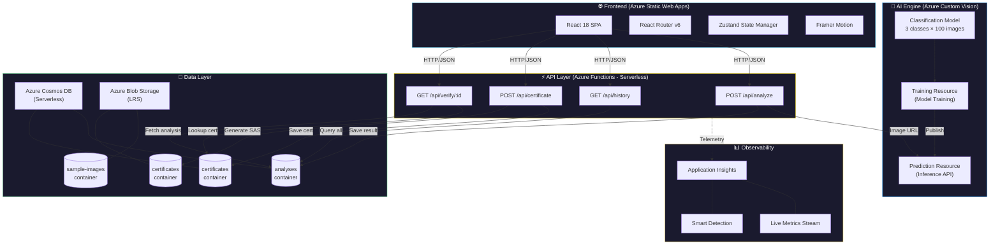
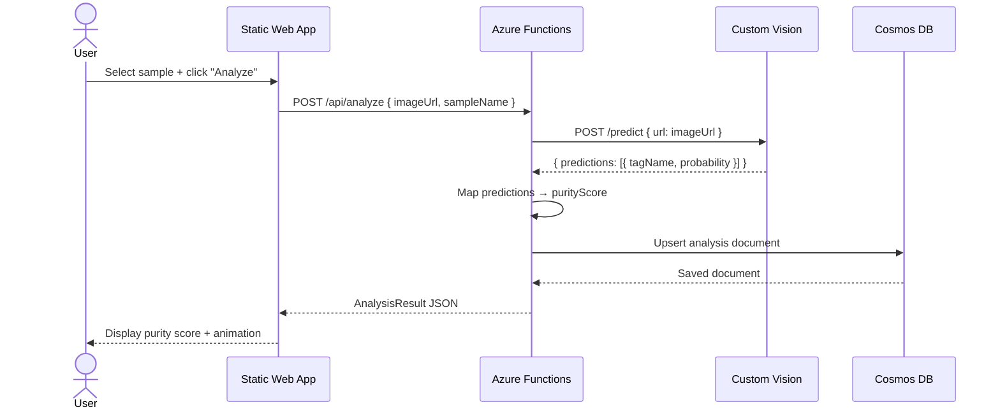
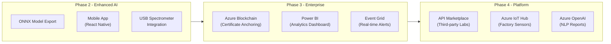

# 🏗️ Architecture — Zaytoun Vision

> Detailed technical architecture for the AI-powered olive oil adulteration detection platform.

---

## System Architecture Diagram



## ASCII Architecture (Fallback)

```
┌─────────────────────────────────────────────────────────────────────────────┐
│                          ZAYTOUN VISION ARCHITECTURE                        │
├─────────────────────────────────────────────────────────────────────────────┤
│                                                                             │
│  ┌──────────────────┐                                                       │
│  │   User / Browser │                                                       │
│  └────────┬─────────┘                                                       │
│           │ HTTPS                                                           │
│           ▼                                                                 │
│  ┌──────────────────────────────────────────────────────┐                   │
│  │          Azure Static Web Apps (Free Tier)            │                   │
│  │  ┌──────────┐  ┌──────────┐  ┌────────────────────┐  │                   │
│  │  │  React   │  │  Router  │  │  Framer Motion     │  │                   │
│  │  │  18 SPA  │  │   v6     │  │  Animations        │  │                   │
│  │  └──────────┘  └──────────┘  └────────────────────┘  │                   │
│  │  ┌──────────────────────────────────────────────────┐ │                   │
│  │  │  Global CDN  •  Auto SSL  •  Custom Domain      │ │                   │
│  │  └──────────────────────────────────────────────────┘ │                   │
│  └──────────────────────┬───────────────────────────────┘                   │
│                         │ /api/*                                             │
│                         ▼                                                   │
│  ┌──────────────────────────────────────────────────────┐                   │
│  │        Azure Functions (Consumption / Serverless)     │                   │
│  │                                                      │                   │
│  │  POST /api/analyze ──────────────▶ Custom Vision API │                   │
│  │     │                                    │           │                   │
│  │     │ Save result                        │ Classify  │                   │
│  │     ▼                                    ▼           │                   │
│  │  GET /api/history ◀──── Cosmos DB ◀── {purityScore,  │                   │
│  │                          (NoSQL)     adulterant,     │                   │
│  │  POST /api/certificate ──▶ Cosmos +    confidence}   │                   │
│  │     │                     Blob Storage               │                   │
│  │     │ Generate cert                                  │                   │
│  │     ▼                                                │                   │
│  │  GET /api/verify/:id ──▶ Cosmos DB (lookup)          │                   │
│  │                                                      │                   │
│  └──────────────────────────────────────────────────────┘                   │
│                         │                                                   │
│                         ▼                                                   │
│  ┌──────────────────────────────────────────────────────┐                   │
│  │              Application Insights                     │                   │
│  │     Live Metrics  •  Logs  •  Smart Alerts           │                   │
│  └──────────────────────────────────────────────────────┘                   │
│                                                                             │
└─────────────────────────────────────────────────────────────────────────────┘
```

---

## Component Descriptions

### 1. Frontend — Azure Static Web Apps

| Aspect | Detail |
|--------|--------|
| **Framework** | React 18 with TypeScript |
| **Build Tool** | Vite 6 (fast HMR, optimized builds) |
| **Routing** | React Router v6 (SPA with deep links) |
| **State** | Zustand (lightweight, no boilerplate) |
| **Animations** | Framer Motion (layout animations, page transitions) |
| **Styling** | Tailwind CSS v4 (utility-first, dark mode) |
| **Hosting** | Azure Static Web Apps Free tier |

**Why Static Web Apps?**
- Built-in global CDN with edge caching
- Automatic SSL certificate provisioning
- GitHub Actions CI/CD integration
- API proxying to Azure Functions (same domain, no CORS issues)
- Staging environments for pull request previews
- Free tier is sufficient for production SPAs

### 2. API Layer — Azure Functions

| Function | Method | Purpose | Cosmos Container |
|----------|--------|---------|-----------------|
| `/api/analyze` | POST | Classify oil sample image | `analyses` (write) |
| `/api/history` | GET | List all past analyses | `analyses` (read) |
| `/api/certificate` | POST | Generate purity certificate | `certificates` (write) |
| `/api/verify/:id` | GET | Verify certificate authenticity | `certificates` (read) |

**Why Azure Functions (Consumption Plan)?**
- **Serverless**: No servers to manage, patch, or scale
- **Pay-per-execution**: First 1M executions/month are free
- **Auto-scale**: Handles bursts (e.g., hackathon demo day) automatically
- **Cold start mitigation**: Node.js runtime starts in ~200ms
- **Integrated auth**: Easy to add Azure AD B2C for producer logins

### 3. AI Engine — Azure Custom Vision

| Component | Purpose |
|-----------|---------|
| **Training Resource** | Upload images, label classes, train model |
| **Prediction Resource** | Serve predictions via REST API |
| **Classification Model** | 3-class image classifier (pure, light, heavy) |

**Classification Classes:**

| Class | Purity Range | Visual Signature | Adulterant |
|-------|-------------|------------------|------------|
| `pure_evoo` | 85-100% | Deep green-gold fluorescence | None |
| `light_adulteration` | 50-84% | Shifted yellow-green | Sunflower (suspected) |
| `heavy_adulteration` | 0-49% | Pale, near-transparent | Soybean (detected) |

**Why Custom Vision (not generic Vision API)?**
- Domain-specific training on our olive oil fluorescence data
- Few-shot learning: works with as few as 15 images per class
- No ML expertise needed (AutoML handles architecture selection)
- ONNX export for future edge/offline deployment
- Free tier: 10,000 predictions/month

### 4. Data Layer — Azure Cosmos DB

**Database:** `zaytoun-vision`

**Container: `analyses`**
```json
{
  "id": "zv-1719340000-a7k2",
  "imageUrl": "/samples/nablus-premium.jpg",
  "sampleName": "Nablus Premium EVOO",
  "purityScore": 97.2,
  "adulterantDetected": null,
  "confidence": 0.982,
  "tags": [
    { "tagName": "pure_evoo", "probability": 0.982 },
    { "tagName": "light_adulteration", "probability": 0.015 },
    { "tagName": "heavy_adulteration", "probability": 0.003 }
  ],
  "timestamp": "2026-06-25T17:00:00.000Z",
  "status": "completed"
}
```

**Container: `certificates`**
```json
{
  "id": "cert-1719340500",
  "analysisId": "zv-1719340000-a7k2",
  "certificateId": "ZV-20260625-A7K2",
  "certificateUrl": "https://zaytoun.blob.core.windows.net/certificates/ZV-20260625-A7K2.pdf?sv=...",
  "issuedAt": "2026-06-25T17:15:00.000Z"
}
```

**Why Cosmos DB Serverless?**
- **Zero minimum cost**: Pay only for consumed RUs (Request Units)
- **Schema flexibility**: Add new fields (acidity, peroxide value) without migrations
- **Global distribution**: Multi-region replication for international markets
- **Change feed**: Enable real-time alerts for adulteration detection
- **Session consistency**: Optimal balance of consistency and performance

### 5. Storage — Azure Blob Storage

| Container | Purpose | Access |
|-----------|---------|--------|
| `sample-images` | Olive oil sample photographs | SAS tokens (read-only, 24h) |
| `certificates` | Generated purity certificate PDFs | SAS tokens (read-only, 24h) |

**Why Blob Storage?**
- Virtually unlimited storage capacity
- Automatic tiering (Hot → Cool → Archive)
- SAS token security eliminates credential exposure
- CDN integration for global image delivery
- Immutability policies for regulatory compliance

### 6. Observability — Application Insights

| Feature | Purpose |
|---------|---------|
| **Live Metrics** | Real-time request rates, failures, latency |
| **Transaction Search** | Trace individual analysis requests end-to-end |
| **Smart Detection** | Automatic anomaly alerts (e.g., spike in failures) |
| **Availability Tests** | Uptime monitoring for the API |
| **Custom Dashboards** | Purity score distribution, prediction latency |

---

## Data Flow — Analysis Request



---

## Security Considerations

| Concern | Mitigation |
|---------|-----------|
| **API Authentication** | Azure Functions host keys + Azure AD B2C (future) |
| **Data in Transit** | HTTPS enforced on all endpoints (TLS 1.2+) |
| **Data at Rest** | Azure Storage Service Encryption (SSE) by default |
| **Blob Access** | SAS tokens with read-only, time-limited permissions |
| **CORS** | Allowlist limited to our domain + localhost |
| **Secrets** | Azure Key Vault integration (production) |
| **Input Validation** | All endpoints validate request body schema |
| **Rate Limiting** | Azure API Management (production) |

---

## Scalability Notes

| Scenario | Approach |
|----------|----------|
| **10 users (hackathon)** | Free tier handles this easily |
| **1,000 users (pilot)** | Consumption plan auto-scales, Cosmos DB serverless |
| **100,000 users (production)** | Upgrade to Premium Functions, Cosmos DB provisioned throughput, CDN for images |
| **Global deployment** | Cosmos DB multi-region writes, Azure Front Door |
| **Offline/edge** | Export Custom Vision model to ONNX, run on mobile/IoT |

### Cost Projection

| Scale | Monthly Cost (est.) |
|-------|-------------------|
| Hackathon demo | $0-1 |
| Small pilot (100 analyses/day) | $5-15 |
| Production (1,000 analyses/day) | $50-100 |
| Enterprise (10,000+ analyses/day) | $200-500 |

---

## Future Architecture Additions



---

*Architecture last updated: June 2026*
